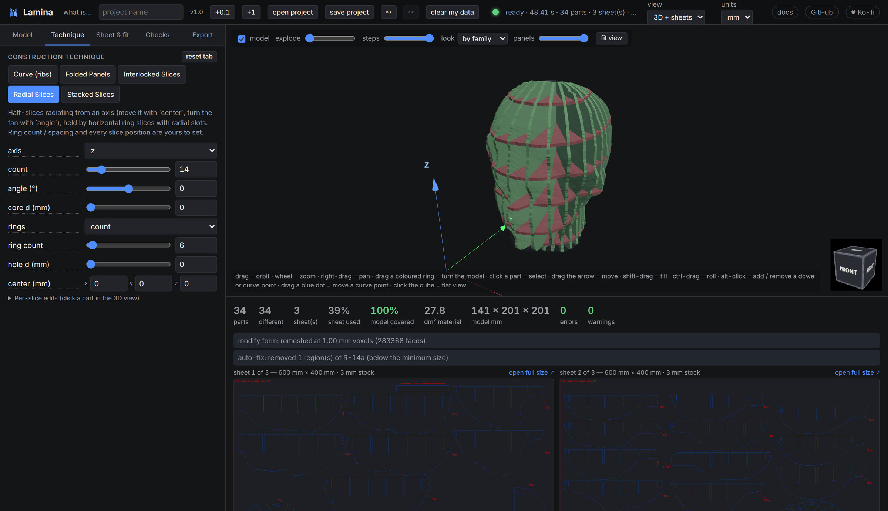
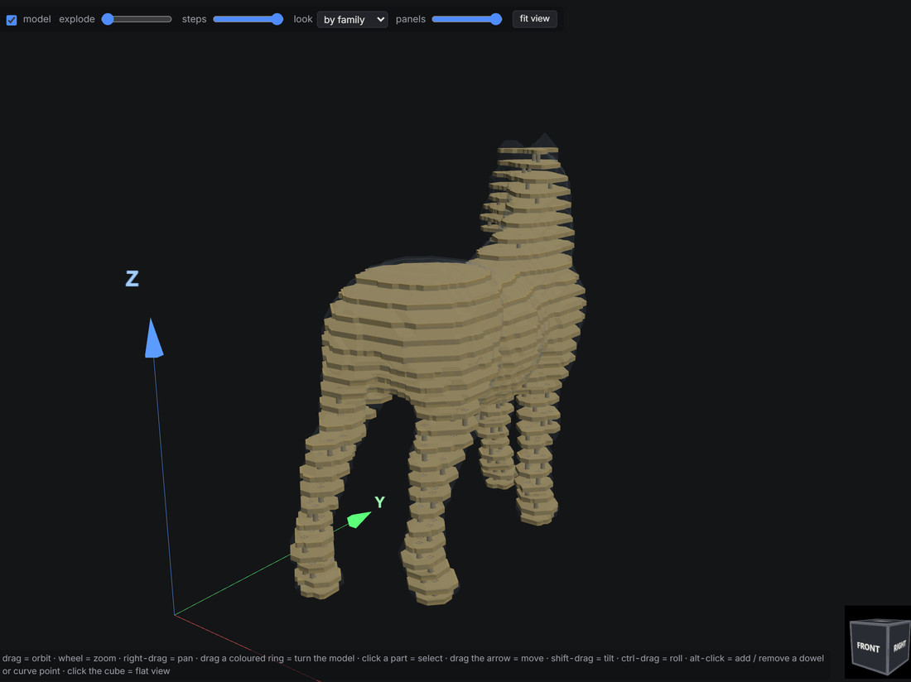
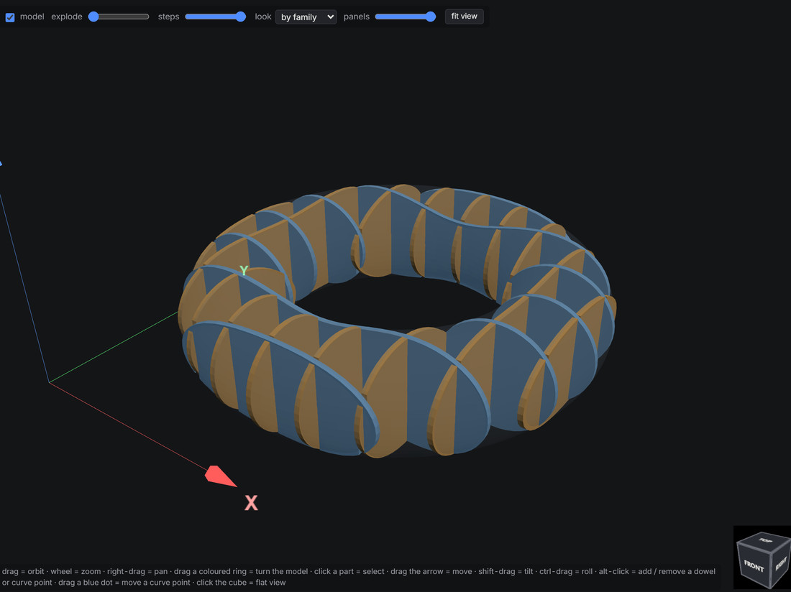
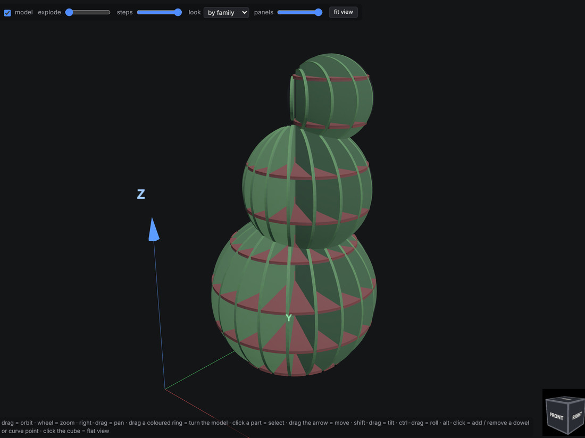
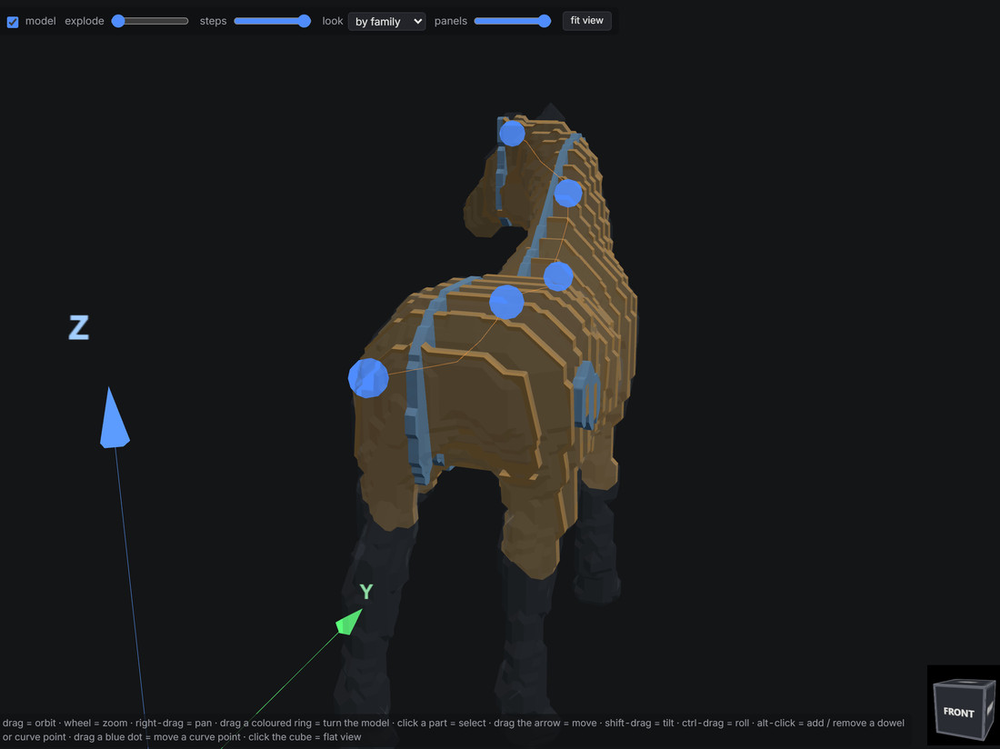
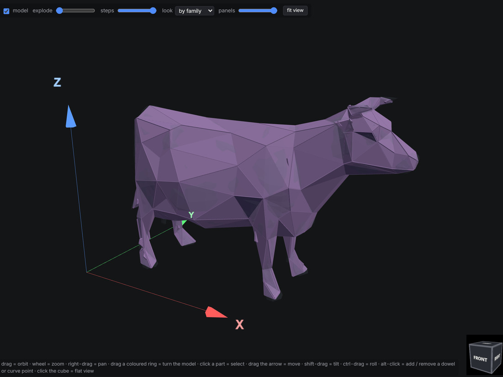
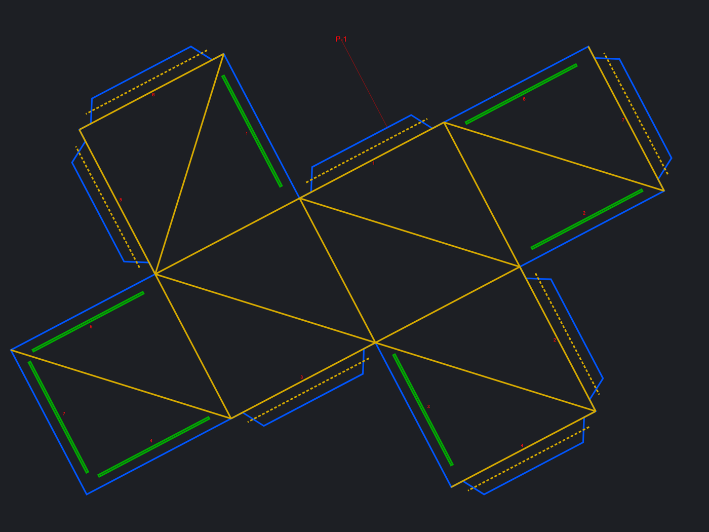
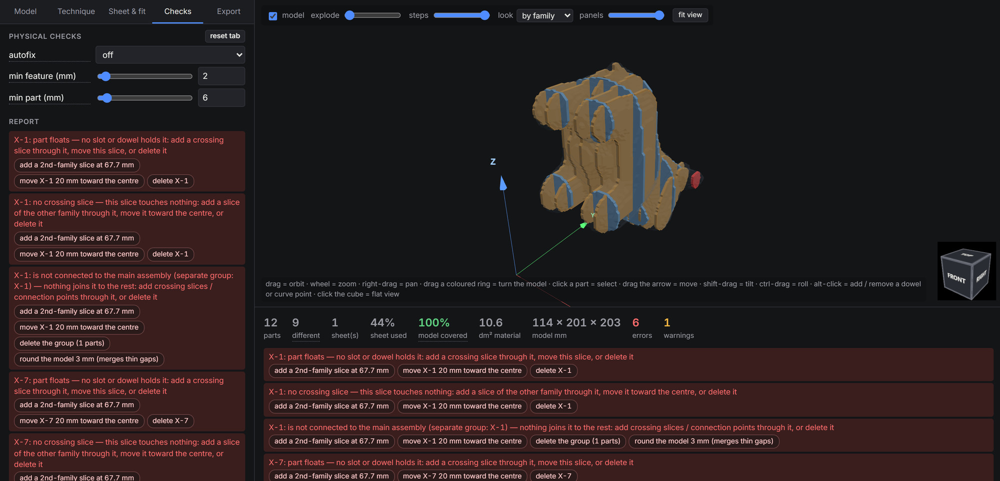
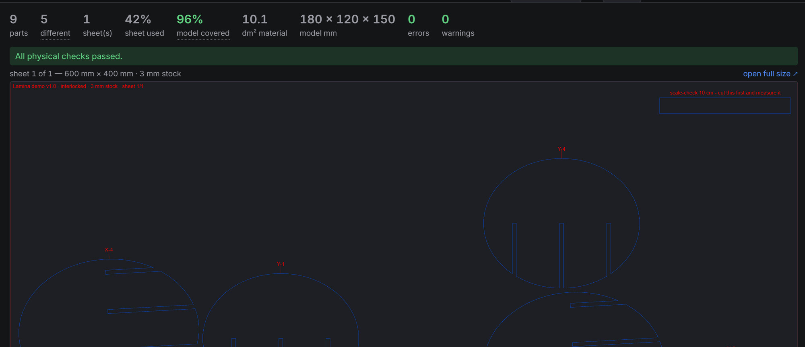

# Lamina

[](https://github.com/marcelfarres/lamina/actions/workflows/test.yml)
[](https://github.com/marcelfarres/lamina/actions/workflows/docker.yml)
[](https://marcelfarres.github.io/lamina/app/)
[](docs/roadmap.md)
[](https://www.python.org/downloads/)
[](https://github.com/marcelfarres/lamina/pkgs/container/lamina)
[](LICENSE)
[](https://ko-fi.com/marcelfarres)

**Turn a 3D model into flat parts you can cut, and check that they go back together.**

Lamina is a free replacement for Autodesk's discontinued *Slicer for Fusion 360*. Load a model, pick a construction
technique, and it computes every part, checks the assembly as a physical object (and fixes or explains what does
not work), nests the parts on your sheets and exports cut files for a laser, CNC router, plasma table or vinyl
cutter. It runs on your own machine; your models never leave it.

**A quick word about the word "slicer"**, because it trips almost everyone up: this is not the 3D-printing kind.
Lamina works out the flat pieces — layers, stacked slices, egg-crate slots, ribs, or a whole surface unfolded flat —
that you cut from plywood, acrylic, cardboard, paper or steel and then put back together into the shape.

## ▶ [Try it in your browser now](https://marcelfarres.github.io/lamina/app/?ref=github-readme)

No install, no account, nothing uploaded — the Python runs in your own browser.

[](https://marcelfarres.github.io/lamina/app/?ref=github-readme)

**[Landing page with screenshots and clips](https://marcelfarres.github.io/lamina/?ref=github-readme)** ·
[parity with the original, option by option](docs/roadmap.md) · [how the unfolding works](docs/folded-panels.md)

## The five ways to build a model

Each one is a clip on the [landing page](https://marcelfarres.github.io/lamina/?ref=github-readme#techniques);
the stills below are the same scenes.

| | |
|---|---|
| [](https://marcelfarres.github.io/lamina/?ref=github-readme#techniques)<br>**Stacked** — parallel sections, touching or spaced, held by dowels, pegs or spacers | [](https://marcelfarres.github.io/lamina/?ref=github-readme#techniques)<br>**Interlocked** — two slotted families, egg-crate |
| [](https://marcelfarres.github.io/lamina/?ref=github-readme#techniques)<br>**Radial** — half-slices around an axis, locked by rings | [](https://marcelfarres.github.io/lamina/?ref=github-readme#techniques)<br>**Curve** — ribs that follow a bend, not the grid |
| [](https://marcelfarres.github.io/lamina/?ref=github-readme#folded)<br>**Folded** — the surface unfolded flat, with 13 joint types | [](https://marcelfarres.github.io/lamina/?ref=github-readme#folded)<br>**Thirteen joints** — seam, tab, gear, tongue, puzzle, laced… |

## What it checks, and what you get

| | |
|---|---|
|  |  |
| **Before you cut**, every part is checked as a physical object: too thin, severed by a slot, held by nothing, larger than your sheet — most with a one-click fix. | **Nesting and cut files**: parts packed against each other's outlines, engraved labels, and SVG, DXF, PDF or EPS with the usual cut / score / engrave layers. |

*(GitHub renders stills only. The moving versions of all of these are on the
[landing page](https://marcelfarres.github.io/lamina/?ref=github-readme).)*

## Why it exists

I built sculptures with Autodesk's Slicer for Fusion 360 for years. It is discontinued, it was hard to use, it
is old, and it never had the parameters I actually needed — I kept wanting to do more than it allowed. I looked
for something with the same possibilities and found nothing, and nothing open source that I could improve myself.
So I started from the use cases I had, every project I had actually made or wanted to make with it, and built
those. So far it has been a pleasure to use: projects that sat in my backlog for years are getting made because
the part between the model and the cut files no longer fights back.

I hope it is useful to you too. If you make something with it, share it — an issue, a pull request with your
model in `examples/`, or wherever you like with the hashtag **#lamina**.

**About how it was made.** A large part of this code was written with AI assistance, directed and reviewed by
me. I am conscious of what that costs, in energy and in its wider effects on people and nature, and I try to use
it deliberately. What it made possible is that a tool I had wanted for a long time exists, works well, is open
source under the AGPL so nobody can close it, and can put a little more art, beauty and playfulness into the
world. That trade felt worth making; you are welcome to disagree, and to make it better.

## Status: early days — and this is where you come in

Lamina is very new. It is an alpha, written by one person, and it will do things you do not expect yet. Every
construction technique of the original is in and the physical checks go further than it ever did, but there are
certainly bugs in here that I have not met.

**Please go and find them.** If something breaks, comes out wrong, or simply annoys you, I would love to hear about
it — every report makes the next person's cut come out better, and it is the quickest way this gets genuinely good.
Nothing is too small to mention.

One habit worth keeping while it is this young: read the checks, and test-cut using the calibration bar on every
sheet before you commit expensive material.

**Found a bug?** [Open an issue](https://github.com/marcelfarres/lamina/issues/new?template=bug_report.yml). The
template asks for the model and the settings that reproduce it. The quickest way to give both is **save project**
in the UI, which writes one file with the model embedded and every parameter in it.

## Quick start

Needs Python 3.11 or newer and [uv](https://docs.astral.sh/uv/); everything else is installed for you.

```bash
git clone https://github.com/marcelfarres/lamina.git
cd lamina
uv sync                                          # add --extra cad for STEP / BREP import
uv run uvicorn web.app:app --reload --port 8000  # then open http://localhost:8000
```

### Or run it as a server

The image on GitHub Container Registry carries everything; the machine that runs it never needs the source.

```bash
docker run -d -p 8000:8000 -v lamina-jobs:/app/working-files ghcr.io/marcelfarres/lamina:latest
```

**No server at all:** the same page runs its Python in a web worker (Pyodide) when nothing answers `api/`. That is
the public demo, at [marcelfarres.github.io/lamina/app](https://marcelfarres.github.io/lamina/app/?ref=github-readme) and on
[Hugging Face](https://marcelfarres-lamina.static.hf.space/app/index.html). [deploy/build_site.py](deploy/build_site.py)
assembles that site — landing page, app, core + web zipped, the bundled models, the pure-Python packages pinned to
`uv.lock` — and the `pages` workflow publishes it to GitHub Pages, and to the Hugging Face static Space when the
`HF_TOKEN` secret is set, on every push to `main`; the deploy only goes out after
[tests/test_e2e_site.py](tests/test_e2e_site.py) has loaded the built site in a real browser and sliced with every
technique. The first visit downloads about 60 MB of Python (cached afterwards, then it starts in a few seconds);
slicing runs at roughly native speed and your models never leave the browser. What differs from the local version:
STEP import is not available, folded panels are decimated by vertex clustering instead of quadric decimation (a
little more angular), and the 3D-print labels are cut through rather than engraved. Visit counting: **none at all in
the copy you self-host or run from Docker** — there is no script and no endpoint in it. The published site counts
visits with GoatCounter (no cookies, no IP stored, so no consent banner) when the `COUNT_URL` repository variable is
set: the landing page records the visit, the referrer, which link was clicked and which clips played, and the demo
records that it was opened. What someone *does* in the demo — technique, whether the model came from the examples or
their own computer, which formats they export — is sent only if they tick the box at the foot of its Model tab.

[docker-compose.yml](docker-compose.yml) is the same thing as a stack for Portainer / Dockge / Komodo: paste it,
and `docker compose pull && docker compose up -d` moves it to the newest build. Every push to `main` publishes
`:latest`, a `v*` tag publishes that version, and jobs live in the `/app/working-files` volume.

Several people can share one server: each browser tab holds a random id, everything it slices lives under that id,
and no other tab can name it. A tab nobody has touched for `LAMINA_TTL_HOURS` (24 by default, 0 = never) is deleted,
models and all, the next time anyone slices; the header's **clear my data** button deletes a tab's own at once.
Uploads over `LAMINA_MAX_UPLOAD_MB` (30 by default) are refused. `WEB_CONCURRENCY` is how many slices run at the same
time (one uvicorn worker each, about 300 MB). Lamina still has no login of its own, so put it behind your reverse
proxy's authentication if the server is reachable from the internet.

The Model tab opens on a bundled example; [examples/](examples/README.md) holds 21 of them, and each opens on the
technique and parameters that suit it ([examples/presets.json](examples/presets.json) — the shape standing the right
way up, sliced without an error; a test keeps that true). The same pipeline runs headless, so it can be scripted:

```bash
uv run python -m core.plan examples/egg.stl --mode interlocked --set nx=5 ny=4 thickness=3 --out out/egg
uv run python -m core.export out/egg.json --out out/egg_cut --fmt svg dxf pdf eps --labels
uv run python -m core.export out/egg.json --out out/egg_pieces --per-piece                  # one file per part
uv run python -m core.solid out/egg.json --out out/egg.stl                                  # assembled solid; --part X-3 for one part
uv run python -m core.solid out/egg.json --proto out/egg_proto --scale 0.5 --labels groove  # scaled 3D-print prototype set
uv run python -m core.plan examples/egg.stl --mode folded --list-params                     # every parameter with its help text
```

## What it does

### Five construction techniques

The original's six techniques as five modes: its *3D Slices* is stacked with `surface=outer`.

| mode | what you get | parts |
|---|---|---|
| `stacked` | parallel sections, touching or with an empty `space`; outline `mid` / `outer` (Slicer's 3D Slices: sand down to shape) / `inner`; connected by **dowels** (6 hole shapes), flat **pegs**, or tabbed **spacers** that keep the space; points aligned, random per pair, or along your 3D lines | `Z-n`, connectors `P-n` |
| `interlocked` | two slotted families, egg-crate; notch ratio / flare / relief; grid rotation; extra slices at chosen positions | `X-n`, `Y-n` |
| `radial` | half-slices around an axis (move it with `center`, turn the fan with `angle`) locked by horizontal ring slices with radial slots; ring count or spacing | `R-na/b`, rings `Z-n` |
| `curve` | ribs perpendicular to a curve through the model (its centre line by default, following the body across the plane too; drag the blue dots, alt-click to add or remove one), so they follow a bend instead of staying parallel; locked together by spine slices. The turn between neighbouring ribs is limited so they do not meet inside the model | `R-n`, spines `K-n` |
| `folded` | surface unfolded into flat panels with score lines (strategies flat / strip / area, or auto); thirteen joints: seam, tab, multitab, diamond, ticked, gear, tongue, puzzle, rivet, laced, loops, strip, rib, each sized to its triangle; **separate** mode cuts every triangle alone | `P-n`, strips `S-n`, ribs `R-n` |

Common to all: model `rotate` (three angles) and slicing `center`, per-slice `offset` / `tilt` / `roll` / `thick` /
`skip` (delete), `size` (a target size on any axis) with `scale` multiplying it, `up_axis`, Modify Form (`shrinkwrap`,
`hollow`, `thicken`, `round`, `smooth`), kerf, slot offset, and splitting of oversize parts with puzzle tabs.

### Checks and fixes

Besides per-part checks (too small, too thin, severed by slots, holes near the outline, overlapping cuts), every plan
is checked as an **assembly**: each region of each slice must reach the main body through a slot, a connector or
glued contact; a head held only by slices that never touch the body is reported as a separate group. `autofix=add`
(the default) first adds crossing slices through regions nothing holds, up to two rounds, then removes what still
cannot work, and lists everything it did. Every remaining error and most warnings carry one-click fixes: add a slice
through the region, move it, delete the group, round the model, change the notch ratio, split the part.

A coverage figure says how much of the model's surface the parts represent, so a leg or an ear that no slice reaches
does not slip through. It carries the most signal for stacked and folded work; dense slicings score close to 100 %.

### Cut sheets and export

- **Nesting** on the part outlines: largest first, at the corners left by already placed parts, each part tried at
  its minimum-rectangle angle plus quarter turns. Above 150 parts a rectangle packer takes over; measured on jobs of
  that size it packs the same and runs a hundred times faster. Usage per sheet is shown.
- **One thickness per sheet**: a part whose thickness you changed is cut from another piece of material, so it is
  nested on sheets of its own. Every sheet title says the stock it is cut from, the sheet header in the UI repeats
  it, and as soon as a job mixes thicknesses the file names carry it (`sheet2_6mm.svg`, `Z-2_6mm.svg`) — a sheet cut
  from the wrong stock fits nothing.
- **One sheet** ignores the sheet height: every part goes on one strip as wide as the sheet and as long as it needs,
  to be cut apart at the machine.
- **Labels** are engraved beside the part with a leader line wherever there is room; only a fully crowded sheet puts
  one on the part.
- **Cut files**: SVG and DXF in mm / cm / in, multi-page PDF, EPS per sheet, or one file per piece, each with or
  without the red label layer (one switch for every file). Layers follow Slicer's Cut Layout: OUTER blue, INNER green
  (slots, holes), SCORE yellow (folds: solid mountain, dashed valley, dotted perforate), LABEL red (labels, leaders,
  seam numbers, sheet border). Files are named `<project or model>_v<revision>_<technique>_…`, so exports of
  different models never collide.
- **Identical pieces once**: in per-piece mode a shape that occurs several times is exported one time, with the
  quantity in the file name (`Z-1_x4.svg`) and the label, and a `cut-list.txt` says which parts each file covers.
- **Scale check**: every export carries a calibration bar, 10 cm or 4 in following the units, to cut first and
  measure before committing to the whole set.
- **Kerf compensation is off by default**: many machines compensate their own kerf, and compensating twice ruins
  the fit. Turn it on under Machine & cut compensation when yours does not.
- **Solids**: STL of the assembled model or one part, and a **prototyping set** for test-printing a design: every part
  flat at a scale or target size, thickness raised to a printable minimum, label engraved as a groove or cut through,
  as one STL per part plus a 3MF that OrcaSlicer or PrusaSlicer opens as separate named objects.

### The web UI

Dark, five tabs (Model · Technique · Sheet & fit · Checks · Export). Every change re-slices; the 3D view and the cut
sheets are always the same plan. Hover a parameter name for its help.

- **3D view**: drag to orbit, wheel to zoom, right-drag to pan. Click a part to select it: a yellow arrow slides it
  along its normal, shift-drag tilts, ctrl-drag rolls, and the panel gets sliders for offset / tilt / roll /
  thickness and a delete button. The selected part is highlighted on the cut sheet, clicking a part on the sheet
  selects it in 3D, and clicking a warning does the same. Alt-click adds or removes a dowel point (stacked) or a
  curve control point (curve). `explode` and `steps` sliders animate the assembly; `look` previews the material.
- **Model**: quarter-turn buttons and three angles to re-orient it, scale or target size, and Modify Form: shrinkwrap,
  hollow, thicken, round (drops features thinner than a radius) and smooth (Taubin passes for pointy vertices).
- **Material, machine, sheet**: the material sets its stock thicknesses (sheet steel by Manufacturers' Standard
  Gauge, plate, plywood and acrylic by fraction of an inch, each shown in mm and decimal inches), the sheet sizes it
  comes in (4 × 8 and 5 × 10 ft, A-series, laser beds) and the 3D look; the machine (CO2 laser, fiber laser, plasma,
  CNC router, knife, by hand) sets kerf, slot offset and corner relief. Saved manufacturing presets keep all of it.
- **View cube**: the cube in the corner of the 3D view turns with the camera; click a face for a flat top, front or
  side view.
- **Session and projects**: the session belongs to the browser tab, so a refresh resumes where you were; a second tab
  is a second session, and on a shared server nobody sees anyone else's models or cut files. Project save / open
  writes one file with the model embedded. Units mm / cm / in for every length field and for the DXF.

## How it is built

```text
web/app.py  (FastAPI)  ──▶  core/plan.py  ──▶  plan.json ──▶  core/export.py   SVG/DXF/PDF/EPS (OUTER, INNER, SCORE, LABEL)
web/static/index.html         │                            ──▶  core/solid.py    assembled / per-part STL, 3MF prototype set
(three.js, live)              ▼                            ──▶  browser          3D view from the facets in plan.json
                     core/modes/*.py   one file per technique (plug-in): Slice objects with a frame + cuts (+ facets)
                     core/unfold.py    mesh → flat panels (greedy flattest-edge spanning tree, overlap-checked)
                     core/notch.py     slots where families cross (ray casts, ratio, flare, relief)
                     core/checks.py    physical checks and auto-fix
                     core/split.py     split oversize parts with puzzle tabs      core/nest.py  outline nesting
                     core/geometry.py  frames, mesh sections → shapely polygons, dowel shapes
```

- **All geometry is computed in Python** (trimesh sections → shapely polygons). The browser only extrudes finished
  polygons; the STL export extrudes the same polygons with trimesh.
- **A construction technique is one file** in `core/modes/` (see `curve.py`, about 70 lines): declare `Param`s and
  return `Slice` objects (frame + thickness + optional clip + cuts, or a ready `raw` profile for synthetic parts).
  Sections, per-slice edits, checks, splitting, nesting, export and the web form are shared and automatic.
- Labels follow Slicer: `Axis-Slice` (`X-3`, `Z-6`), split pieces `Axis-Slice-Part` (`X-3-1`).

### Fit and cut compensation

| parameter | acts on | effect |
|---|---|---|
| `compensate`, `kerf` | every outline, at export | when on, outer edges grow by kerf/2 and slots and holes shrink by kerf/2, so the cut part comes out at nominal size; off by default because most machines compensate their own kerf |
| `slot_offset` | slot width | Slicer's "Slot Offset": nominal slot = crossing slice thickness; + looser, − press fit |
| `notch_ratio` | slot depth | where the two families meet along a crossing (0.5 = half and half) |
| `notch_factor`, `notch_angle` | slot mouth | Slicer's Notch Factor: flares the entrance so parts find the slot |
| `relief`, `tool_d` | slot corners | dog-bone / T-bone relief for router or plasma |
| `thick` / `offset` / `tilt` / `roll` | one slice | per-slice thickness, position along its normal, rotation about its in-plane axes |

Slot depth is exact per crossing: the line where two slices meet is cast against the mesh and every in-material
segment gets its own slot (a torus crossing gets two).

### Physical checks

Errors mean it will not work, warnings mean look at it. Part too small or too thin (minimum rotated rectangle) ·
thin bridge (erosion) · slots or holes sever the part · region floats (no slot, dowel or core holds it) · no crossing
slice · not connected to the main assembly (region-level connectivity through slots, connectors and glued contact) ·
plane misses material · does not fit the sheet (auto-split when `split` is on) · two slots overlap · hole too close
to the outline · folded: joint shrunk or skipped for its triangle, listed by seam number · slot opens away from the
insertion direction. Every message says what to do about it.

## Tests

The `test` workflow runs the suite on every push and pull request; `docker` and `pages` publish from `main` only,
and `pages` deploys nothing until the built site has sliced with every technique in a real browser.

```bash
uv run ruff check                       # lint (pyflakes, bugbear, bandit, pyupgrade); the test workflow runs it first
uv run pytest tests                     # pipeline, nesting, checks, export, the web API, the browser build's code path,
                                        # and every slider end / choice / toggle of every technique (tests/test_params.py)
uv run --with pytest-cov pytest --cov=core --cov=web --cov-report=term-missing   # coverage: 88 % of core + web
uv run python tests/browser_env.py working-files/jobs   # the whole matrix without the compiled extras Pyodide lacks
python deploy/build_site.py && uv run --with playwright playwright install chromium
LAMINA_E2E=1 uv run --with playwright pytest tests/test_e2e_site.py   # the built site, end to end, in Chromium
uv run python tests/test_unfold.py      # folded-panel correctness: refold, area, seams, joints (a few minutes)
uv run python tests/run_matrix.py       # regression matrix of model × mode × feature → working-files/matrix/contact.png
uv run python -m core.testmodels examples/   # regenerate the synthetic example shapes
```

## Folder layout

```text
core/        planner, modes, unfold, notch, checks, nest, split, export, solid
web/         FastAPI app + single-page UI (vendored three.js)
examples/    21 test models: 16 synthetic + a scanned head, three animals and the bunny (terms in examples/README.md)
docs/        index.html + media/ (the GitHub Pages site), roadmap.md, folded-panels.md, original-slicer-reference.md
tests/       pytest suite, test_unfold.py, run_matrix.py
```

### Serving the docs

[The landing page](https://marcelfarres.github.io/lamina/) is `docs/`, served by GitHub Pages from `main` — plain
HTML with no build step, so any static server shows exactly what Pages will:

```bash
uv run python -m http.server 8080 --directory docs   # then open http://localhost:8080
```

The `.md` files next to it (`roadmap.md`, `folded-panels.md`) are read on GitHub rather than through the page.

## Contributing

Issues and pull requests are welcome. A new construction technique is one file in `core/modes/`; checks, nesting
and export come for free. Run the tests above before opening a pull request, and say which example and settings
you checked the change on.

## Support

Lamina is free and always will be, and none of that depends on anyone giving me anything. If you like it or any of
my other projects and you want to support the work, there is [Ko-fi](https://ko-fi.com/marcelfarres) — only if you
can comfortably afford it, and with no pressure at all.

Other ways that help just as much: tell someone who cuts sheet material that this exists, show me what you made, or
open an issue when something goes wrong. A good bug report is worth more to me than a coffee.

## Licence

Lamina is free software under the [GNU Affero General Public License v3.0](LICENSE). You can use it, change it and
share it. Anyone who distributes a modified version, or offers it to others as a service, must publish their
source under the same licence.

**What you make with it is yours.** The cut files, parts and objects you produce are not covered by the licence;
sell them, give them away, do as you like. Only the program itself is copyleft. The bundled example models have
their own terms, listed in [examples/README.md](examples/README.md).
